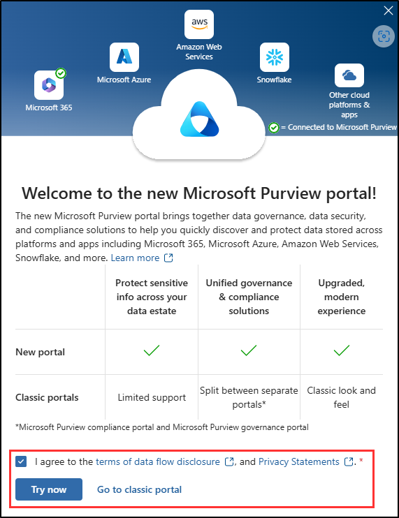

---
lab:
  task: Prepare your environment for administration
  exercise: Exercise 0 - Prepare your environment for administration
---

## Locataires WWL - Conditions d’utilisation

Si un locataire vous est fourni dans le cadre d’une formation dispensée par un instructeur, notez qu’il est mis à votre disposition dans le seul but de prendre en charge les labos pratiques de la formation.

Vous ne devez ni partager ni utiliser les locataires en dehors des labos pratiques. Le locataire utilisé dans ce cours est un locataire d’essai. Au terme de la classe, le locataire ne pourra pas faire l’objet d’une prolongation et vous ne pourrez plus l’utiliser ni y accéder.

Vous n’êtes pas autorisé à convertir un locataire en abonnement payant. Les locataires obtenus dans le cadre de ce cours sont la propriété de Microsoft Corporation. Nous nous réservons le droit d’y accéder et d’en reprendre possession à tout moment.

# Configuration du labo : préparer votre environnement pour l’administration

Dans ce labo, vous allez configurer et préparer votre environnement pour les tâches d’administration. Vous allez activer les fonctionnalités nécessaires, configurer les autorisations d’administration et vous assurer de la bonne configuration des éléments essentiels.

**Tâches :**

- Activer l’audit dans le portail Microsoft Purview
- Activer la recherche par nom dans Microsoft Teams
- Activer les cloisonnements d’informations dans SharePoint Online et OneDrive.

## Tâche - Activer l’audit dans le portail Microsoft Purview

Dans cette tâche, vous allez activer l’audit dans le portail Microsoft Purview pour surveiller les activités du portail. Pour les exercices de ces laboratoires, l’audit est nécessaire pour créer une stratégie d’étiquetage automatique.

1. Dans Microsoft Edge, accédez au portail Microsoft Purview, `https://purview.microsoft.com`, et connectez-vous en tant qu’utilisateur disposant de droits d’**administrateur général**.

1. Un message à propos du nouveau portail Microsoft Purview s’affiche à l’écran. Sélectionnez l’option permettant d’accepter les conditions de divulgation de flux de données et la déclaration de confidentialité, puis sélectionnez **Essayer maintenant**.

    

1. Sélectionnez **Solutions** dans la barre latérale de gauche, puis **Audit**.

1. Sur la page **Recherche**, sélectionnez la barre **Démarrer l’enregistrement de l’activité des utilisateurs et des administrateurs** pour activer la journalisation d’audit.

    

1. Après que vous avez sélectionné cette option, la barre bleue doit disparaître de cette page.

Vous avez activé l’audit dans Microsoft 365.

## Tâche - Attribuer des rôles de conformité

Dans cette tâche, vous allez attribuer le rôle d’**administrateur de conformité** à l’utilisateur que vous utiliserez pour ces exercices de labo.

1. Ouvrez **Microsoft Edge** et accédez au centre d’administration Microsoft 365, `https://admin.microsoft.com`. Vous devez vous connecter en tant qu’utilisateur disposant de droits d’**administrateur général**.

1. Développez **Utilisateurs** dans la barre latérale de gauche, puis sélectionnez **Utilisateurs actifs**.

1. Sélectionnez ou créez un utilisateur pour poursuivre ces exercices de labo.

   Si vous choisissez d’utiliser un utilisateur existant, sélectionnez un utilisateur disposant de droits et de privilèges d’accès minimaux.

   1. Si vous créez un nouvel utilisateur, attribuez à l’utilisateur une licence qui convient à ces exercices de labo. L’utilisateur doit disposer d’une licence Microsoft 365 E5 ou d’un module complémentaire compatible pour réaliser ces exercices. Attribuez à l’utilisateur le rôle d’**administrateur de conformité** dans les paramètres facultatifs de la configuration du nouvel utilisateur et finalisez la création du nouvel utilisateur.

   1. Si vous modifiez l’accès d’un utilisateur existant, sélectionnez l’utilisateur, puis **Gérer les rôles**. Attribuez à l’utilisateur le rôle d’**administrateur de conformité** et enregistrez vos modifications.

1. Déconnectez-vous du compte avec l’accès d’administrateur général en sélectionnant son icône d’utilisateur en haut à droite, puis sélectionnez **Se déconnecter**.

   Exemple :

   

Vous avez attribué à un utilisateur le rôle d’**administrateur de conformité**, qui est requis pour effectuer les différents exercices de ce labo.

## Tâche - Explorer le portail Microsoft Purview

Dans cette tâche, vous allez vous connecter en tant que l’utilisateur auquel vous avez précédemment accordé le rôle d’**administrateur de conformité** afin d’explorer le portail Microsoft Purview. Ce rôle sera appelé **administrateur de conformité** dans les laboratoires et les exercices suivants.

1. Dans **Microsoft Edge**, accédez à **`https://purview.microsoft.com`**.

1. Dans la fenêtre **Choisir un compte** qui s’affiche, sélectionnez **Utiliser un autre compte**.

1. Lorsque la fenêtre **Se connecter** s’affiche, connectez-vous en tant que l’utilisateur que vous aviez précédemment désigné comme **administrateur de conformité**.

1. Familiarisez-vous avec le portail de conformité Microsoft Purview. Lorsque vous avez terminé, laissez la fenêtre du navigateur ouverte.

Vous avez basculé vers le compte de l’**administrateur de conformité** et êtes maintenant en mesure de démarrer le labo.
